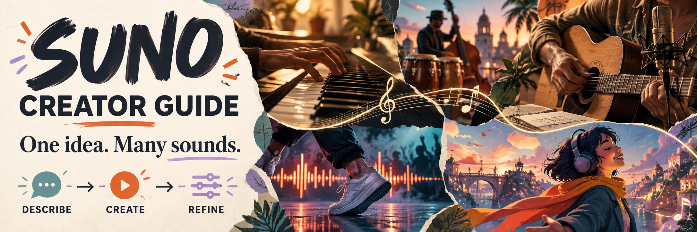
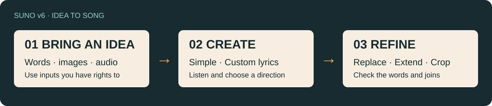
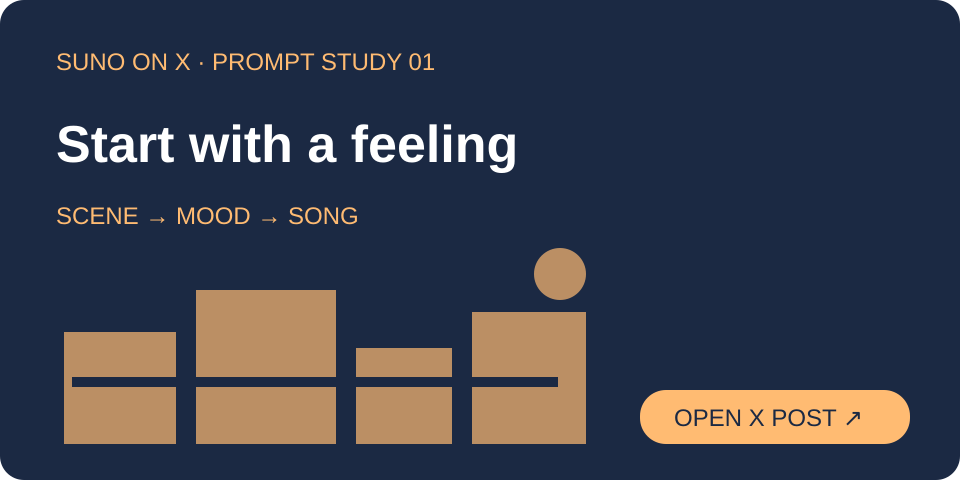
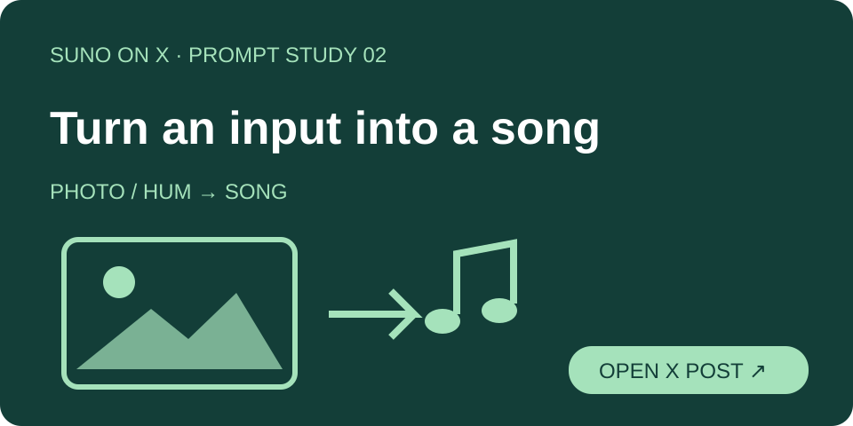
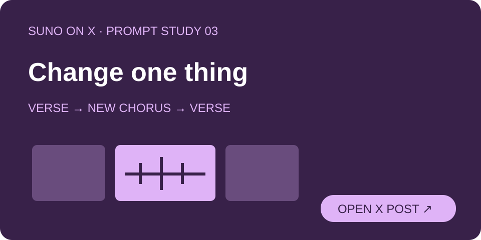
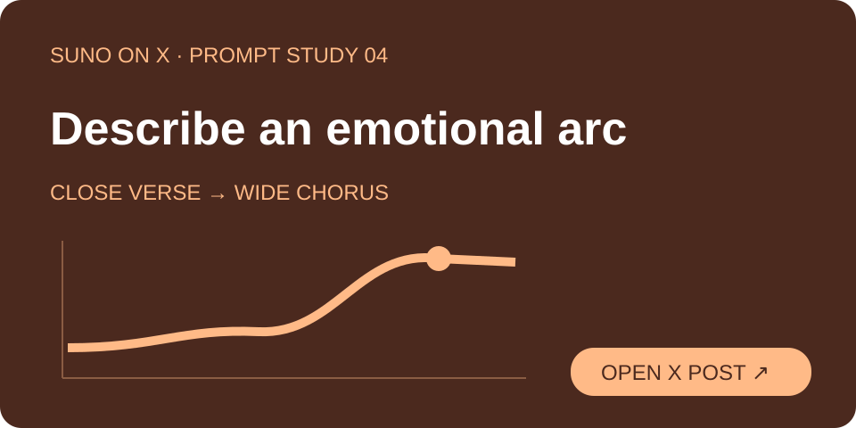
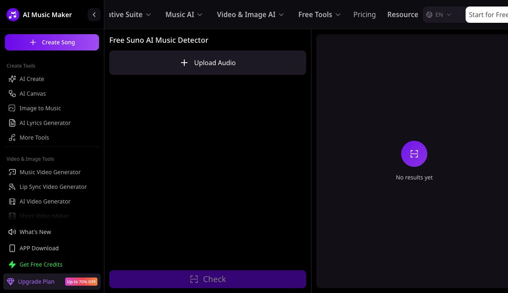

<!-- Generated by scripts/build_mobile_readmes.py; edit the desktop README instead. -->
<div align="center">

# Guía de creación musical con Suno: prompts, ejemplos y tutoriales

**Una idea, muchos sonidos.**

Folk, dance, jazz o música para animaciones y cortometrajes. Describe tu idea en Suno, escucha el resultado y mejora las partes que más te gusten.

<!-- LANGUAGES:START -->
<p align="center">
<a href="README.md"></a>
<a href="README_ZH.md"></a>
<a href="README_TW.md"></a>
<a href="README_JA.md"></a>
<a href="README_KO.md"></a>
<a href="README_ID.md"></a>
<a href="README_IT.md"></a>
<a href="README_PT.md"></a>
<a href="README_ES.md" aria-current="page"></a>
<a href="README_DE.md"></a>
<a href="README_RU.md"></a>
<a href="README_FR.md"></a>
<a href="README_TH.md"></a>
<a href="README_VI.md"></a>
<a href="README_AR.md"></a>
</p>
<!-- LANGUAGES:END -->

<!-- DEVICE-VIEW:START -->
<p align="center"><a href="../README_ES.md"></a></p>
<!-- DEVICE-VIEW:END -->

<a href="https://help.suno.com/en/articles/13924481"></a>

<p><a href="#official"></a> <a href="#examples"></a> <a href="#briefs"></a></p>
<p align="center"><a href="#start"><strong>▶ Crea tu primera canción</strong></a> · <a href="../docs/troubleshooting.md">Resuelve problemas · Inglés</a></p>
</div>

[MusicMaker](https://github.com/aimusicmaker) publica y mantiene esta guía y opera las herramientas MusicMaker que se presentan aquí. Los tutoriales y ejercicios detallados están en inglés. [Publicación y edición · Inglés](../docs/editorial-policy.md).

<a id="official"></a>
## Qué puedes hacer con Suno v6

Empieza con una idea, una foto, un vídeo o un tarareo. Usa Simple para describir una idea y Custom para introducir el estilo y la letra por separado.

[](https://help.suno.com/en/articles/13924481)

v6-mini está disponible en todos los planes; v6 y v6-wild requieren Pro / Premier. Las instrucciones no garantizan una duración exacta ni la conservación de una melodía. Escucha y revisa el resultado.

[Guía oficial ↗](https://help.suno.com/en/articles/13924481) · [Suno v6 ↗](https://help.suno.com/en/articles/13924801)

<sub>Información de modelos verificada el 2026-09-23.</sub>

<a id="examples"></a>
## Ejemplos oficiales de prompts en X

Cada imagen abre la publicación original de Suno; las tarjetas resumen los puntos clave.

<p align="center"><a href="https://x.com/suno/status/2098504030204973500"></a><br><a href="https://x.com/suno/status/2098504030204973500"><b>Empieza con una escena ↗</b></a></p>

<p align="center"><a href="https://x.com/suno/status/2098504032079814672"></a><br><a href="https://x.com/suno/status/2098504032079814672"><b>Usa una foto o un tarareo ↗</b></a></p>

<p align="center"><a href="https://x.com/suno/status/2098504033698812198"></a><br><a href="https://x.com/suno/status/2098504033698812198"><b>Cambia una sola cosa ↗</b></a></p>

<p align="center"><a href="https://x.com/suno/status/2098504035292618787"></a><br><a href="https://x.com/suno/status/2098504035292618787"><b>Describe la evolución emocional ↗</b></a></p>

<a id="briefs"></a>
## Escucha y elige una idea para crear

<!-- COMMUNITY-CASES:START -->
Elige una dirección entre nueve casos de la comunidad en X. Pulsa una imagen para ver la publicación original; las notas explican prompts publicados y métodos de producción.

<p align="center"><a href="https://x.com/maxescu/status/2049444543360336167"></a><br><b>Tech house: prompt breve y modelo personalizado</b><br><sub><a href="https://x.com/maxescu/status/2049444543360336167">@maxescu</a> · 2026-04-29</sub><br><sub>Prompt musical publicado</sub><br><a href="https://x.com/maxescu/status/2049444543360336167">▶ Ver en X</a> · <a href="../docs/x-community-examples.md#case-2049444543360336167">Notas · inglés →</a></p>

<p align="center"><a href="https://x.com/KiwiJazzTutor/status/2069599574000586959"></a><br><b>Piano y jazz latino</b><br><sub><a href="https://x.com/KiwiJazzTutor/status/2069599574000586959">@KiwiJazzTutor</a> · 2026-06-24</sub><br><sub>Proceso / obra terminada</sub><br><a href="https://x.com/KiwiJazzTutor/status/2069599574000586959">▶ Ver en X</a> · <a href="../docs/x-community-examples.md#case-2069599574000586959">Notas · inglés →</a></p>

<p align="center"><a href="https://x.com/Framer_X/status/2093001366922744183"></a><br><b>Anima una canción</b><br><sub><a href="https://x.com/Framer_X/status/2093001366922744183">@Framer_X</a> · 2026-08-27</sub><br><sub>Proceso / obra terminada</sub><br><a href="https://x.com/Framer_X/status/2093001366922744183">▶ Ver en X</a> · <a href="../docs/x-community-examples.md#case-2093001366922744183">Notas · inglés →</a></p>

<p align="center"><a href="https://x.com/juliewdesign_/status/1928099450884333867"></a><br><b>Música para escenas cotidianas</b><br><sub><a href="https://x.com/juliewdesign_/status/1928099450884333867">@juliewdesign_</a> · 2025-05-29</sub><br><sub>Proceso / obra terminada</sub><br><a href="https://x.com/juliewdesign_/status/1928099450884333867">▶ Ver en X</a> · <a href="../docs/x-community-examples.md#case-1928099450884333867">Notas · inglés →</a></p>

<p align="center"><a href="https://x.com/HashemGhaili/status/1929615615133966391"></a><br><b>Música para un corto de ciencia ficción</b><br><sub><a href="https://x.com/HashemGhaili/status/1929615615133966391">@HashemGhaili</a> · 2025-06-02</sub><br><sub>Proceso / obra terminada</sub><br><a href="https://x.com/HashemGhaili/status/1929615615133966391">▶ Ver en X</a> · <a href="../docs/x-community-examples.md#case-1929615615133966391">Notas · inglés →</a></p>

<p align="center"><a href="https://x.com/demon_ai_/status/1797764913198154072"></a><br><b>Crea un vídeo musical completo</b><br><sub><a href="https://x.com/demon_ai_/status/1797764913198154072">@demon_ai_</a> · 2024-06-03</sub><br><sub>Proceso / obra terminada</sub><br><a href="https://x.com/demon_ai_/status/1797764913198154072">▶ Ver en X</a> · <a href="../docs/x-community-examples.md#case-1797764913198154072">Notas · inglés →</a></p>

<p align="center"><a href="https://x.com/Attack/status/1797664905568412055"></a><br><b>Retoma una melodía antigua</b><br><sub><a href="https://x.com/Attack/status/1797664905568412055">@Attack</a> · 2024-06-03</sub><br><sub>Proceso / obra terminada</sub><br><a href="https://x.com/Attack/status/1797664905568412055">▶ Ver en X</a> · <a href="../docs/x-community-examples.md#case-1797664905568412055">Notas · inglés →</a></p>

<p align="center"><a href="https://x.com/Hermion28758241/status/1802200978969559447"></a><br><b>Haz una canción sobre gatos</b><br><sub><a href="https://x.com/Hermion28758241/status/1802200978969559447">@Hermion28758241</a> · 2024-06-16</sub><br><sub>Proceso / obra terminada</sub><br><a href="https://x.com/Hermion28758241/status/1802200978969559447">▶ Ver en X</a> · <a href="../docs/x-community-examples.md#case-1802200978969559447">Notas · inglés →</a></p>

<p align="center"><a href="https://x.com/DJKNEK/status/2001536418393543105"></a><br><b>Desarrolla un remix funk por etapas</b><br><sub><a href="https://x.com/DJKNEK/status/2001536418393543105">@DJKNEK</a> · 2025-12-18</sub><br><sub>Prompt musical publicado</sub><br><a href="https://x.com/DJKNEK/status/2001536418393543105">▶ Ver en X</a> · <a href="../docs/x-community-examples.md#case-2001536418393543105">Notas · inglés →</a></p>
<!-- COMMUNITY-CASES:END -->

<a id="start"></a>
## Crea tu primera canción

**[Suno · Crear canción ↗](https://suno.com/create)** · **[MusicMaker · Crear canción ↗](https://musicmaker.im/ai-song-generator/)**

1. Abre una de las dos herramientas y selecciona Custom.
2. Pega el estilo en Styles de Suno o Music Style de MusicMaker; la letra va en Lyrics.
3. El ejercicio siguiente es instrumental: activa Instrumental y deja Lyrics vacío. Revisa el modelo, los créditos y la visibilidad antes de generar.

Adaptación instrumental inspirada en los instrumentos de Morning with Healing Hands.

**Pendiente de prueba de escucha**

```text
An instrumental acoustic piece for a quiet everyday scene.
Fingerpicked guitar leads, with upright bass and light strings.
Keep the mood warm and hopeful. No singing or spoken voice.
```

Las cuentas, los créditos y los derechos de uso son independientes. Un mismo prompt no garantiza el mismo resultado.

[Guía detallada · inglés →](../docs/official-suno-guide.md)

### MusicMaker · Escuchar · 12

Explora **12 sonidos más** con canciones distintas de las propuestas anteriores. Las portadas y los títulos abren el estilo publicado; Escuchar abre el tema original.

[MusicMaker · 148 · 中文 / English →](../docs/musicmaker-catalog.md)

<!-- BRAND-STYLES:START -->
<p align="center"><a href="../docs/musicmaker-catalog.md#discover-v2-26"></a><br><b>City pop</b><br><a href="../docs/musicmaker-catalog.md#discover-v2-26">Plastic Midnight</a><br><a href="https://musicmaker.im/detail/discover-v2-26/">▶ Escuchar</a></p>

<p align="center"><a href="../docs/musicmaker-catalog.md#discover-v2-11"></a><br><b>Blues del pantano</b><br><a href="../docs/musicmaker-catalog.md#discover-v2-11">Cypress Moon Rising</a><br><a href="https://musicmaker.im/detail/discover-v2-11/">▶ Escuchar</a></p>

<p align="center"><a href="../docs/musicmaker-catalog.md#discover-v2-43"></a><br><b>Deep house</b><br><a href="../docs/musicmaker-catalog.md#discover-v2-43">Midnight Rearview</a><br><a href="https://musicmaker.im/detail/discover-v2-43/">▶ Escuchar</a></p>

<p align="center"><a href="../docs/musicmaker-catalog.md#discover-v2-78"></a><br><b>Soul lo-fi</b><br><a href="../docs/musicmaker-catalog.md#discover-v2-78">Sunrise On Vinyl</a><br><a href="https://musicmaker.im/detail/discover-v2-78/">▶ Escuchar</a></p>

<p align="center"><a href="../docs/musicmaker-catalog.md#discover-v2-28"></a><br><b>Pop oscuro</b><br><a href="../docs/musicmaker-catalog.md#discover-v2-28">Glass Dolls</a><br><a href="https://musicmaker.im/detail/discover-v2-28/">▶ Escuchar</a></p>

<p align="center"><a href="../docs/musicmaker-catalog.md#discover-v2-46"></a><br><b>Country moderno</b><br><a href="../docs/musicmaker-catalog.md#discover-v2-46">Bonfire Kinda Night</a><br><a href="https://musicmaker.im/detail/discover-v2-46/">▶ Escuchar</a></p>

<p align="center"><a href="../docs/musicmaker-catalog.md#discover-v2-86"></a><br><b>Phonk brasileño</b><br><a href="../docs/musicmaker-catalog.md#discover-v2-86">Rua Em Chamas</a><br><a href="https://musicmaker.im/detail/discover-v2-86/">▶ Escuchar</a></p>

<p align="center"><a href="../docs/musicmaker-catalog.md#discover-v2-29"></a><br><b>Dream pop</b><br><a href="../docs/musicmaker-catalog.md#discover-v2-29">First Look, Forever</a><br><a href="https://musicmaker.im/detail/discover-v2-29/">▶ Escuchar</a></p>

<p align="center"><a href="../docs/musicmaker-catalog.md#discover-10"></a><br><b>Hyper-afrobeat</b><br><a href="../docs/musicmaker-catalog.md#discover-10">Awakening echoes</a><br><a href="https://musicmaker.im/detail/discover-10/">▶ Escuchar</a></p>

<p align="center"><a href="../docs/musicmaker-catalog.md#discover-v2-22"></a><br><b>Electrónica ambiental</b><br><a href="../docs/musicmaker-catalog.md#discover-v2-22">Midnight Garden Circuits</a><br><a href="https://musicmaker.im/detail/discover-v2-22/">▶ Escuchar</a></p>

<p align="center"><a href="../docs/musicmaker-catalog.md#discover-v2-19"></a><br><b>House tropical</b><br><a href="../docs/musicmaker-catalog.md#discover-v2-19">Salt on My Skin</a><br><a href="https://musicmaker.im/detail/discover-v2-19/">▶ Escuchar</a></p>

<p align="center"><a href="../docs/musicmaker-catalog.md#discover-37"></a><br><b>Synthwave</b><br><a href="../docs/musicmaker-catalog.md#discover-37">City pulse</a><br><a href="https://musicmaker.im/detail/discover-37/">▶ Escuchar</a></p>
<!-- BRAND-STYLES:END -->

<!-- MUSICMAKER-DETECTOR:START -->
<a id="musicmaker-detector"></a>

## MusicMaker · ¿Esa canción también se hizo con IA?

Escuchar las obras de otras personas también ayuda a encontrar inspiración. Cuando una canción te llama la atención, quizá te preguntes si se creó con Suno u otra herramienta de IA.

Para esos momentos, puedes probar **Free Suno AI Music Detector de MusicMaker**. Sube el audio para ver una estimación de la probabilidad de generación con IA y, cuando se identifique, la posible herramienta utilizada.

<p align="center"><a href="https://musicmaker.im/"></a><br><strong>AI Music Maker</strong></p>

<a href="https://musicmaker.im/free-suno-ai-music-detector/"></a>

<sub>Interfaz en inglés.</sub>

Sube el audio → inicia sesión y pulsa **Check** → consulta la predicción y la probabilidad de IA.

**[Prueba el detector de música de MusicMaker →](https://musicmaker.im/free-suno-ai-music-detector/)** · [Cómo interpretar el resultado · Inglés](../docs/detector-and-release.md)

<sub>Los resultados de detección son orientativos. Confirma con el autor los derechos de uso de la obra.</sub>
<!-- MUSICMAKER-DETECTOR:END -->

[Sources · English](../docs/sources.md) · [Contributing · English](../CONTRIBUTING.md)

<!-- BRAND-AFFILIATE:START -->
### Colabora con MusicMaker

MusicMaker ofrece un programa de afiliados para creadores, autores de reseñas, educadores y comunidades. Recomienda MusicMaker a tu público y recibe comisiones por los pedidos que cumplan los requisitos del programa.

**[Conoce el programa de afiliados y cómo participar →](https://musicmaker.im/affiliate-program/)**
<!-- BRAND-AFFILIATE:END -->
